# fullstack-open-2020 part10 - React Native <br>

Course of the University of Helsinki about building single page applications with ReactJS that use REST APIs built with Node.js.

Learn how to build native Android and iOS mobile applications with JavaScript and React using the React Native framework. Dive into the React Native ecosystem by developing an entire mobile application from scratch. Along the way, we will learn concepts such as how to render native user interface components with React Native, how to create beautiful user interfaces, how to communicate with a server, and how to test a React Native application.

For more info see the course website: <br>
https://fullstackopen.com/en/part10

[Course Notes part 10a](#notes-a.-introduction-to-react-native) <br>
[Course Notes part 10b](#notes-part-b.-react-native-basics) <br>
[Course Notes part 10c](#notes-part-c.-communicating-with-the-server) <br>
[Course Notes part 10d](#notes-part-d.-testing-and-extending-our-application) <br>
[Screenshots of the app created during the course](#screenshots-of-the-app-created-during-the-course) <br>
[Course Review part 10 - React Native](#course-review-part-10-react-native) <br>
[Course Review Fullstack Open part 1-9](https://github.com/l0ve2cr3ate/fullstack-open-2020/blob/master/README.md#review-fullstack-open-2020) <br>
[Course Review part 11 - CI/CD](https://github.com/l0ve2cr3ate/fullstack-open-part11-bloglist#course-review-part-11-fullstack-open) <br>

### Exercises a. Introduction to React Native

Exercise 10.1 <br>
Exercise 10.1: initializing the application <br>
Initialize your application with Expo command-line interface and set up the development environment either using an emulator or Expo's mobile app. It is recommended to try both and find out which development environment is the most suitable for you. The name of the application is not that relevant, you can, for example, go with rate-repository-app. <br>

To submit this exercise and all the future exercises you need to create a new GitHub repository. The name of the repository can be for example the name of the application you initialized with expo init. Now that the repository is created, run git init within your application's root directory to make sure that the directory is initialized as a Git repository. Next, to add the created repository as the remote run git remote add origin git@github.com:<YOURGITHUBUSERNAME>/<NAMEOFYOUR_REPOSITORY>.git (remember to replace the placeholder values in the command). Finally, just commit and push your changes into the repository and you are all done. <br>

Exercise 10.2 <br>
Exercise 10.2: setting up the ESLint <br>
Set up ESLint in your project so that you can perform linter checks by running npm run lint. To get most of linting it is also recommended to integrate ESLint with your editor. <br>

For more info about the exercises of part a, see: https://fullstackopen.com/en/part10/introduction_to_react_native <br>

### Notes a. Introduction to React Native

React Native is a framework for developing native Android and iOS apps using JS and React. It provides a set of cross-platform components that utilize the platforms native components. <br>

**What we will be building** <br>
In this part we will create an app for rating GitHub repo's. The app will contain features such as filtering and sorting reviewed repo's, registering a use, logging in and creating a review for a repo. The backend of the app will be provided. <br>

**Initializing React Native app**
_Expo_ is like `create-react-app` for React Native. To use expo, you will need to install expo-cli: <br>
`npm install --global expo-cli` <br>
To initialize the app, use the command: <br>
`expo init name-of-app` <br>

`app.json` file in expo project contains the expo related config.
Running `npm start` script will start the Metro bundler, a JS bundler for React Native (kind of like webpack for react native ecosystem). To run the app in the browser, click `Run in webbrowser` in expo development tools. <br>

**Setting up the development environment** <br>
Android and iOS devices van be emulated in computers using specific emulators. macOS can use both Android and iOS emulators, while other operating systems like Linux and Windows can only use Android emulators. After setting up an emulator, you can run your React Native app in it.
You can also use Expo mobile app to preview your app on an actual mobile device. <br>

**ESlint** <br>
To add eslint to expo project install `eslint babel-eslint eslint-plugin-react` as dev dependencies and add linting rules in `.eslintrc` file in the root of project. Add a lint script to `package.json`: <br>
`"lint": "eslint ./src/**/*{js, jsx} -no-error-on-unmatched-pattern"` --> `-no-error-unmatched-pattern` prevents error when there are no files in linting directory. <br>

**Viewing logs** <br>
Expo developments tools display log messages. Errors and warnings can also be viewed in emulator and mobile expo app. `console.log` can be used to help with debugging. <br>

### Exercises b. React Native Basics

Exercise 10.3. <br>
Exercise 10.3: the reviewed repositories list <br>
In this exercise, we will implement the first version of the reviewed repositories list. The list should contain the repository's full name, description, language, number of forks, number of stars, rating average and number of reviews. Luckily React Native provides a handy component for displaying a list of data, which is the FlatList component. <br>

Implement components RepositoryList and RepositoryItem in the components directory's files RepositoryList.jsx and RepositoryItem.jsx. The RepositoryList component should render the FlatList component and RepositoryItem a single item on the list (hint: use the FlatList component's renderItem prop). Use this as the basis for the RepositoryList.jsx file: <br>

```javascript
import React from "react";
import { FlatList, View, StyleSheet } from "react-native";

const styles = StyleSheet.create({
  separator: {
    height: 10,
  },
});

const repositories = [
  {
    id: "jaredpalmer.formik",
    fullName: "jaredpalmer/formik",
    description: "Build forms in React, without the tears",
    language: "TypeScript",
    forksCount: 1589,
    stargazersCount: 21553,
    ratingAverage: 88,
    reviewCount: 4,
    ownerAvatarUrl: "https://avatars2.githubusercontent.com/u/4060187?v=4",
  },
  {
    id: "rails.rails",
    fullName: "rails/rails",
    description: "Ruby on Rails",
    language: "Ruby",
    forksCount: 18349,
    stargazersCount: 45377,
    ratingAverage: 100,
    reviewCount: 2,
    ownerAvatarUrl: "https://avatars1.githubusercontent.com/u/4223?v=4",
  },
  {
    id: "django.django",
    fullName: "django/django",
    description: "The Web framework for perfectionists with deadlines.",
    language: "Python",
    forksCount: 21015,
    stargazersCount: 48496,
    ratingAverage: 73,
    reviewCount: 5,
    ownerAvatarUrl: "https://avatars2.githubusercontent.com/u/27804?v=4",
  },
  {
    id: "reduxjs.redux",
    fullName: "reduxjs/redux",
    description: "Predictable state container for JavaScript apps",
    language: "TypeScript",
    forksCount: 13902,
    stargazersCount: 52869,
    ratingAverage: 0,
    reviewCount: 0,
    ownerAvatarUrl: "https://avatars3.githubusercontent.com/u/13142323?v=4",
  },
];

const ItemSeparator = () => <View style={styles.separator} />;

const RepositoryList = () => {
  return (
    <FlatList
      data={repositories}
      ItemSeparatorComponent={ItemSeparator}
      // other props
    />
  );
};

export default RepositoryList;
```

Do not alter the contents of the repositories variable, it should contain everything you need to complete this exercise. Render the RepositoryList component in the Main component which we previously added to the Main.jsx file. <br>

Exercises 10.4. - 10.5. <br>
Exercise 10.4: the app bar <br>
We will soon need to navigate between different views in our application. That is why we need an app bar to display tabs for switching between different views. Create a file AppBar.jsx in the components folder with the following content:

```javascript
import React from "react";
import { View, StyleSheet } from "react-native";
import Constants from "expo-constants";

const styles = StyleSheet.create({
  container: {
    paddingTop: Constants.statusBarHeight,
    // ...
  },
  // ...
});

const AppBar = () => {
  return <View style={styles.container}>{/* ... */}</View>;
};

export default AppBar;
```

Now that the AppBar component will prevent the status bar from overlapping the content, you can remove the marginTop style we added for the Main component earlier in the Main.jsx file. The AppBar component should currently contain a tab with text "Repositories". Make the tab touchable by using the TouchableWithoutFeedback component but you don't have to handle the onPress event in any way. Add the AppBar component to the Main component so that it is the uppermost component in the screen. <br>
The background color of the app bar in the image is #24292e but you can use any other color as well. It might be a good idea to add the app bar's background color into the theme configuration so that it is easy to change it if needed. Another good idea might be to separate the app bar's tab into its own component such as AppBarTab so that it is easy to add new tabs in the future.The background color of the app bar in the image is #24292e but you can use any other color as well. It might be a good idea to add the app bar's background color into the theme configuration so that it is easy to change it if needed. Another good idea might be to separate the app bar's tab into its own component such as AppBarTab so that it is easy to add new tabs in the future. <br>

Exercise 10.5: polished reviewed repositories list <br>
The current version of the reviewed repositories list looks quite grim. Modify the RepositoryListItem component so that it also displays repository author's avatar image. You can implement this by using the Image component. Counts, such as number of stars and forks, larger than or equal to 1000 should be displayed in thousands with precision of one decimal and with a "k" suffix. This means that for example fork count of 8439 should be displayed as "8.4k". <br>

Exercises 10.6. - 10.7. <br>
Exercise 10.6: the sign in view <br>
We will soon implement a form, which a user can use to sign in to our application. Before that, we must implement a view that can be accessed from the app bar. Create a file SignIn.jsx in the components directory.
Set up a route for this SignIn component in the Main component. Also add a tab with text "Sign in" in to the app bar next to the "Repositories" tab. User should be able to navigate between the two views by pressing the tabs (hint: use the Link component and its component prop). <br>

Exercise 10.7: scrollable app bar <br>
As we are adding more tabs to our app bar, it is a good idea to allow horizontal scrolling once the tabs won't fit the screen. The ScrollView component is just the right component for the job.

Wrap the tabs in the AppBar component's tabs with a ScrollView component.
Setting the horizontal prop true will cause the ScrollView component to scroll horizontally once the content won't fit the screen. Note that, you will need to add suitable style properties to the ScrollView component so that the tabs will be laid in a row inside the flex container. You can make sure that the app bar can be scrolled horizontally by adding tabs until the last tab won't fit the screen. Just remember to remove the extra tabs once the app bar is working as intended. <br>

Exercise 10.8. <br>
Exercise 10.8: the sign in form <br>
Implement a sign in form to the SignIn component we added earlier in the SignIn.jsx file. The sign in form should include two text fields, one for the username and one for the password. There should also be a button for submitting the form. You don't need to implement a onSubmit callback function, it is enough that the form values are logged using console.log when the form is submitted. <br>

Exercise 10.9. <br>
Exercise 10.9: validating the sign in form <br>
Validate the sign in form so that both username and password fields are required. Note that the onSubmit callback implemented in the previous exercise, should not be called if the form validation fails.

The current implementation of the FormikTextInput component should display an error message if a touched field has an error. Emphasize this error message by giving it a red color.

On top of the red error message, give an invalid field a visual indication of an error by giving it a red border color. Remember that if a field has an error, the FormikTextInput component sets the TextInput component's error prop as true. You can use the value of the error prop to attach conditional styles to the TextInput component. <br>

Exercise 10.10. <br>
Exercise 10.10: a platform specific font >br
Currently the font family of our application is set to System in the theme configuration located in the theme.js file. Instead of the System font, use a platform specific Sans-serif font. In the Android platform use the Roboto font and in the iOS platform use the Arial font. The default font can be System. <br>

For more info about the exercises of part b React Native Basics, see: <br>
https://fullstackopen.com/en/part10/react_native_basics <br>

### Notes part b. React Native Basics

In this section you will learn how to build user interfaces with RN's core components, how to add style properties to core components, how to transition between views, and how to manage form state. <br>

**Core components** <br>
React can be used to define components as functions, which receive props and return a tree of React elements. In the browser environment ReactDOM library is used to turn these components into a DOM tree which can be rendered by the browser. React is not bound to an environment, like the browser. Libraries like ReactDOM render a set of predefined components, like DOM elements in the browser. In RN these predefined components are called _core components_. These _core components_ utilize the platform's native components. <br>
Examples of _core components_:

- `Text` component: only RN component that can have textual children, similar to `<h1>` or `<p>`
- `View` component: similar to `<div>` element
- `TextInput` component: text field, similar to `<input>` element
- `TouchableWithoutFeedback` component: component capturing different press events, similar to `<button>` <br>

Differences between core components and DOM elements: <br>

- Text component is the only RN component that can have textual children, while in React for example `<div>` element can have text in it.
- Event handlers like `onClick` can be added to basically any element, such as `<div>` and `<button>`, while in RN you have to look into the API docs to know what event handlers a components accepts. `TouchableWithoutFeedback` component for example accepts `onPress` prop (which is similar to `onClick`). <br>

**Manually reloading the app** <br>
Expo automatically reloads app when you make changes. If this doesn't work, you can manually reload the app by shaking your device or using `Ctrl + M` shortcut on Windows/Linux. This will open up the developer menu, where you can press `Reload`. <br>

**Style** <br>
In RN most core components accept a `style` prop, which accepts an object with style properties and their values. Property names use camelCase, like `fontSize`. In RN all dimension related values are _unitless_ and represent _density-independent-pixels_. Defining styles directly in style prop is not very readable. Define styles outside the component using `StyleSheet.create()` method, which accepts a single argument: an object consisting of named style objects. `Style` prop also accepts an array of objects. These objects are merged from left to right, so latter style properties take presence. It works recursively. Values evaluating to false are ignored. This makes conditional styling possible: <br>

```javascript
const textStyles = [
  styles.text,
  isBlue && styles.blueText,
  isBig && styles.bigText,
];
```

**Consistent user interface with theming** <br>
Theming leads to increased consistency and flexibility. You can use variables like `colors.primary` instead of `#fff`. RN does not support global style. You can store your theme values in an object: <br>

```javascript
const theme = {
  colors: {
    textPrimary: "#24292e",
    textSecondary: "#586069",
    primary: "#0366d6",
  },
  fontSizes: {
    body: 14,
    subheading: 16,
  },
  fonts: {
    main: "System",
  },
  fontWeights: {
    normal: "400",
    bold: "700",
  },
};

export default theme;
```

and use theme in components like this: <br>

```javascript
import React from "react";
import { Text as NativeText, StyleSheet } from "react-native";

import theme from "../theme";

const styles = StyleSheet.create({
  text: {
    color: theme.colors.textPrimary,
    fontSize: theme.fontSizes.body,
    fontFamily: theme.fonts.main,
    fontWeight: theme.fontWeights.normal,
  },
  colorTextSecondary: {
    color: theme.colors.textSecondary,
  },
  colorPrimary: {
    color: theme.colors.primary,
  },
  fontSizeSubheading: {
    fontSize: theme.fontSizes.subheading,
  },
  fontWeightBold: {
    fontWeight: theme.fontWeights.bold,
  },
});

const Text = ({ color, fontSize, fontWeight, style, ...props }) => {
  const textStyle = [
    styles.text,
    color === "textSecondary" && styles.colorTextSecondary,
    color === "primary" && styles.colorPrimary,
    fontSize === "subheading" && styles.fontSizeSubheading,
    fontWeight === "bold" && styles.fontWeightBold,
    style,
  ];

  return <NativeText style={textStyle} {...props} />;
};

export default Text;
```

**Using flexbox for layout** <br>
Flexbox is a layout entity consisting of two separate components:

- _flex container_: can be created using `display: 'flex'`, and has flex items as it's direct children.
- _flex items_: immediate children of _flex container_.

Most important properties of _flex container_: <br>

- `flexDirection`: Direction in which flex items are laid out in container:`row`, `row-reverse`, `column` (default), `column-reverse`. `row` --> positions flex items from left to right. `column` --> positions flex items from top to bottom.
- `justifyContent`: alignment of flex items along **main** axis.
- `alignItems`: same as `justifyContent` but for **opposite** axis. <br>

One of the most commonly used properties of _flex item_ is `flexGrow` property. If all flex items have `flexGrow: 1`, they will share available space evenly. If one flex item has `flexGrow: 0` it will only take the space it's content requires, and leave the rest of the space for the other flex items. <br>
**Note:** In RN the _property names_ are the same as in CSS, except the naming uses camelCase in RN, but the _property values_ (`flex-start`) are exactly the same. <br>

**Routing** <br>
In RN you can't reference pages with urls typed into browser address bar, nor can you navigate back and forth using the browser's history API. But you can use React Router. Only `BrowserRouter` needs to be replaced with `NativeRouter` from `react-router-native` lib. Using `react-router-native` lib will break Expo's web browser preview. This can be fixed by extending Expo's Webpack config, so it transpiles `react-router-native` lib sources with Babel. For this you will need to install `@expo/webpack-config` lib, and add the following to `webpack.config.js` file in the root directory of your project: <br>

```javascript
const path = require("path");
const createExpoWebpackConfigAsync = require("@expo/webpack-config");

module.exports = async function (env, argv) {
  const config = await createExpoWebpackConfigAsync(env, argv);

  config.module.rules.push({
    test: /\.js$/,
    loader: "babel-loader",
    include: [path.join(__dirname, "node_modules/react-router-native")],
  });

  return config;
};
```

Now you can wrap the `Main` component in the `App.jsx` file with `NativeRouter` and add routes to `Main.jsx` file. <br>

**Form state management** <br>
Form implementation relies heavily on state management. `useState` can be good enough for small forms, but for more complex forms state management can quite tedious --> `Formik` to the rescue. Formik's main concepts are: `context` and `fields`. The formik context is provided by the `Formik` component that contains the form's state. It contains info of form fields, like value and validation errors. State's fields can be referenced by their name using `useField` hook or `Field` component.
Initial values for fields are provided to `initalValues` prop as object, with fieldnames as keys and inital values as values. Submit callback is provided through `onSubmit` prop. It gets called when `handleSubmit` function is called **and** there are NO validation errors. <br>
`useField` hook has one argument: name of the field and returns an array with three values: <br>
`[field, meta, helpers]`. <br>

- _field_ object contains the value of the field.
- _meta_ object contains field meta info like possible error message.
- _helpers_ object contains actions for changing the sate of the field, like _setValue_ function.

**Note**: the component that uses `useField` hook has to be **withtin** Formik's context. In other words, the component has to be a descendant of the Formik component. <br>

Using `useField` hook for multiple text fields in a form causes repetitive code, which can be extracted into a separate component to create a custome TextInput component:

```javascript
import React from "react";
import { TextInput as NativeTextInput, StyleSheet } from "react-native";

const styles = StyleSheet.create({});

const TextInput = ({ style, error, ...props }) => {
  const textInputStyle = [style];

  return <NativeTextInput style={textInputStyle} {...props} />;
};

export default TextInput;
```

```javascript
import React from "react";
import { StyleSheet } from "react-native";
import { useField } from "formik";

import TextInput from "./TextInput";
import Text from "./Text";

const styles = StyleSheet.create({
  errorText: {
    marginTop: 5,
  },
});

const FormikTextInput = ({ name, ...props }) => {
  const [field, meta, helpers] = useField(name);
  const showError = meta.touched && meta.error;

  return (
    <>
      <TextInput
        onChangeText={(value) => helpers.setValue(value)}
        onBlur={() => helpers.setTouched(true)}
        value={field.value}
        error={showError}
        {...props}
      />
      {showError && <Text style={styles.errorText}>{meta.error}</Text>}
    </>
  );
};

export default FormikTextInput;
```

The `TextInput` let's you reuse your styled TextInput field, while the `FormikTextInput` creates formik bindings in a reusable component, to prevent repetitive code. The `FormikTextInput` can be used inside a component like this:

```javascript
<FormikTextInput name="mass" placeholder="Weight (kg)" />
```

**Form Validation** <br>
Formik has two ways to handle form validation:

- validation function
- validation schema

_Validation function_ is a function provided for formik components as the value of the `validate` prop. It takes in form values as a argument and returns an object containing possible field specific error messages. <br>
A _validation schema_ can be created with a validation library `Yup`, and is provided for Formik components as value of `validationSchema` prop. <br>
By default validation is done when a field's value changes and when `handleSubmit` function is called. If validation fails, the function provided for `onSubmit` prop of Formik component is not called. You can also choose to display an error only when a field is touched (received and lost focus):

```javascript
const showErrror = meta.touched && meta.error;
```

**Platform specific code** <br>
The user's platform can be accessed through `Platform.OS` constant, which can be 'android' or 'ios'. You can also use `Platform.select`, which will return the most fitting platform the user is currently running on, choosing from 'ios', 'android', 'native' and 'default'. You can use these to implement platform specific styling. If you want to use platform specific components you could use `Platform.select` or just use `.ios.jsx` or `.android.jsx` file extensions. <br>

### Exercises c. Communicating with the server

In this part data will be fetched from a server. The server can be found in this repository: https://github.com/fullstack-hy2020/rate-repository-api Follow the instructions in the README to setup the server. <br>
To start the Expo app on mobile device: <br>
Copy the content of `.env.template` file to `.env` file in the root directory, change the ip-address, and run the command: <br>
`npm start` and open the Expo app on your mobile and scan the QR code. <br>

Exercise 10.11. <br>
Exercise 10.11: fetching repositories with Apollo Client <br>
We want to replace the Fetch API implementation in the useRepositories hook with a GraphQL query. Open the GraphQL Playground at http://localhost:5000/graphql and open the documentation by clicking the docs tab. Look up the repositories query. The query has some arguments, however, all of these are optional so you don't need to specify them. In the GraphQL Playground form a query for fetching the repositories with the fields you are currently displaying in the application. The result will be paginated and it contains the up to first 30 results by default. For now, you can ignore the pagination entirely.

Once the query is working in the GraphQL Playground, use it to replace the Fetch API implementation in the useRepositories hook. This can be achieved using the useQuery hook. The gql template literal tag can be imported from the Apollo Boost as instructed earlier. Consider using the structure recommended earlier for the GraphQL related code. To avoid future caching issues, use the cache-and-network fetch policy in the query. It can be used with the useQuery hook like this:

```javascript
useQuery(MY_QUERY, {
  fetchPolicy: "cache-and-network",
  // Other options
});
```

The changes in the useRepositories hook should not affect the RepositoryList component in any way. <br>

Exercise 10.12. <br>
Exercise 10.12: environment variables <br>
Instead of the hardcoded Apollo Server's URL, use an environment variable defined in the .env file when initializing the Apollo Client. You can name the variable for example APOLLO_URI. <br>

Note: My `.env` file is in `.gitignore`. Copy the content of `.env.template` file to `.env` file, and change the ip-address. <br>

Exercises 10.13. - 10.14. <br>
Exercise 10.13: the sign in form mutation <br>
The current implementation of the sign in form doesn't do much with the submitted user's credentials. Let's do something about that in this exercise. First, read the rate-repository-api server's authorization documentation and test the provided queries in the GraphQL Playground. If the database doesn't have any users, you can populate the database with some seed data. Instructions for this can be found in the getting started section of the README.

Once you know how the authorization queries are supposed to work, create a file useSignIn.js file in the hooks directory. In that file implement a useSignIn hook that sends the authorize mutation using the useMutation hook. Note that the authorize mutation has a single argument called credentials, which is of type AuthorizeInput. This input type contains username and password fields.

The return value of the hook should be a tuple [signIn, result] where result is the mutations result as it is returned by the useMutation hook and signIn a function that runs the mutation with a { username, password } object argument. Hint: don't pass the mutation function to the return value directly. Instead, return a function that calls the mutation function like this:

```javascript
const useSignIn = () => {
  const [mutate, result] = useMutation(/* mutation arguments */);

  const signIn = async ({ username, password }) => {
    // call the mutate function here with the right arguments
  };

  return [signIn, result];
};
```

Once the hook is implemented, use it in the SignIn component's onSubmit callback for example like this:

```javascript
const SignIn = () => {
  const [signIn] = useSignIn();

  const onSubmit = async (values) => {
    const { username, password } = values;

    try {
      const { data } = await signIn({ username, password });
      console.log(data);
    } catch (e) {
      console.log(e);
    }
  };

  // ...
};
```

This exercise is completed once you can log the user's authorize mutations result after the sign in form has been submitted. The mutation result should contain the user's access token. <br>

Exercise 10.14: storing the acess token step1 <br>
Now that we can obtain the access token we need to store it. Create a file authStorage.js in the utils directory with the following content:

```javascript
import { AsyncStorage } from "react-native";

class AuthStorage {
  constructor(namespace = "auth") {
    this.namespace = namespace;
  }

  getAccessToken() {
    // Get the access token for the storage
  }

  setAccessToken(accessToken) {
    // Add the access token to the storage
  }

  removeAccessToken() {
    // Remove the access token from the storage
  }
}

export default AuthStorage;
```

Next, implement the methods AuthStorage.getAccessToken, AuthStorage.setAccessToken and AuthStorage.removeAccessToken. Use the namespace variable to give your keys a namespace like we did in the previous example. <br>

Exercises 10.15. - 10.16. <br>
Exercise 10.15: storing the access token step2 <br>
Improve the useSignIn hook so that it stores the user's access token retrieved from the authorize mutation. The return value of the hook should not change. The only change you should make to the SignIn component is that you should redirect the user to the reviewed repositories list view after a successful sign in. You can achieve this by using the (useHistory)[https://reacttraining.com/react-router/native/api/Hooks/usehistory] hook and the history's push method. <br>

After the authorize mutation has been executed and you have stored the user's access token to the storage, you should reset the Apollo Client's store. This will clear the Apollo Client's cache and re-execute all active queries. You can do this by using the Apollo Client's resetStore method. You can access the Apollo Client in the useSignIn hook using the useApolloClient hook. Note that the order of the execution is crucial and should be the following:

```javascript
const { data } = await mutate(/* options */);
await authStorage.setAccessToken(/* access token from the data */);
apolloClient.resetStore();
```

Exercise 10.16: sign out <br>
The final step in completing the sign in feature is to implement a sign out feature. The authorizedUser query can be used to check the authorized user's information. If the query's result is null, that means that the user is not authorized. Open the GraphQL playground and run the following query:

```javascript
{
  authorizedUser {
    id
    username
  }
}
```

You will probably end up with the null result. This is because the GraphQL Playground is not authorized, meaning that it doesn't send a valid access token with the request. Revise the authorization documentation and retrieve an access token using the authorize mutation. Use this access token in the Authorization header as instructed in the documentation. Now, run the authorizedUser query again and you should be able to see the authorized user's information. <br>

Open the AppBar component in the AppBar.jsx file where you currently have the tabs "Repositories" and "Sign in". Change the tabs so that if the user is signed in the tab "Sign out" is displayed, otherwise show the "Sign in" tab. You can achieve this by using the authorizedUser query with the useQuery hook. <br>

Pressing the "Sign out" tab should remove the user's access token from the storage and reset the Apollo Client's store with the resetStore method. Calling the resetStore method should automatically re-execute all active queries which means that the authorizedUser query should be re-executed. Note that the order of execution is crucial: access token must be removed from the storage before the Apollo Client's store is reset. <br>

For more info about part c exercises Communicating with the server, see: <br>
https://fullstackopen.com/en/part10/communicating_with_server

### Notes part c. Communicating with the server

In this part you will learn how to communicate with a server using HTTP requests, how to use Apollo Client in React Native app and how to store data in user's device. You will use a rate-repository api server which uses SQLitedb and provides Apollo GraphQL API + a few REST API endpoints. <br>

**HTTP requests** <br>
RN provides _fetch API_ for making HTTP requests. It also supports _XMLHTTPReq API_, so it is possible to use third party libraries like `axios`. <br>
Sending HTTP requests using _fetch API_ can be done using `fetch` function, which takes _url_ of resource as first argument. Default request method is `GET`. Second argument of `fetch` function is `options` object, where you can specify different request methods, request headers, request body, etc. Compared to `axios`, the _fetch API_ operates on a bit lower level. There is not any request/response body serialization and parsing. So you will have to set the `Content-Type` header yourself and use `JSON.stringify` to serialize the request body:

```javascript
fetch("https://my-api.com/post-end-point", {
  method: "POST",
  headers: {
    Accept: "application/json",
    "Content-Type": "application/json",
  },
  body: JSON.stringify({
    firstParam: "firstValue",
    secondParam: "secondValue",
  }),
});
```

The `fetch` function returns a Promise which resolves a _response object_. <br>
**Note:** Error status codes such as 400 and 500 are NOT rejected like in `axios`. <br>
In case of a JSON formatted response, you can parse the response body using `response.json` method:

```javascript
const fetchMovies = async () => {
  const response = await fetch("https://url-to-fetch-data-from.com");
  const json = await response.json();

  return json;
};
```

To access the server, you can't use localhost. You have to replace it with the server's IP-address in the local network, which can be found in Expo Development Tools after `exp://`. <br>

The code for fetching repositories can be extracted to a custom hook, so it can be reused:

```javascript
import { useState, useEffect } from "react";

const useRepositories = () => {
  const [repositories, setRepositories] = useState();
  const [loading, setLoading] = useState(false);

  const fetchRepositories = async () => {
    setLoading(true);

    const response = await fetch("http:<IP-ADDRESS>:5000/api/repositories");
    const json = await response.json();

    setLoading(false);
    setRepositories(json);
  };

  useEffect(() => {
    fetchRepositories();
  }, []);

  return { repositories, loading, refetch: fetchRepositories };
};

export default useRepositories;
```

In the component you can use the custom hook like so:

```javascript
const { respositories } = useRepositories();
```

**GraphQL and Apollo Client** <br>
Apollo Client can be used with RN the same way as with React. The graphQL playground can be access from 'http://localhost:5000/graphql'. `Apollo Boost` library is a zero-config way to start using Apollo Client. To connect Apollo Client to Apollo Server:

```javascript
import ApolloClient from "apollo-boost";

const createApolloClient = () => {
  return new ApolloClient({
    uri: "http:<IP-ADDRESS>:5000/graphql",
  });
};

export default createApolloClient;
```

`ApolloProvider context` is needed to provide Apollo Client:

```javascript
const apolloClient = createApolloClient();

const App = () => {
  return (
    <NativeRouter>
      <ApolloProvider client={apolloClient}>
        <Main />
      </ApolloProvider>
    </NativeRouter>
  );
};
```

**Organizing GraphQL related code** <br>
One possible way to structure graphQL files: define queries, mutations and fragments in their own files in graphql directory. Store the queries in a variable and import them to use with `useQuery` hook:

```javascript
const { data, error, loading } = useQuery(GET_REPOSITORIES);
```

**Evolving the structure** <br>
Once your app becomes bigger, there might be times when certain files grow to large to manage. Example: component A renders component B and C, while all these components are defined in component A file. You can extract components B and C to their own files in the components directory (first solution), or create a directory A in the components directory and create B and C there. A will also be moved into this directory, and be renamed `index.js` (second solution).

First solution would look like this:

```javascript
components/
  A.jsx
  B.jsx
  C.jsx
  ...
```

Second solution would look like this:

```javascript
components/
  A/
    B.jsx
    C.jsx
    index.jsx
  ...
```

First solution is great if components B and C are used outside component A or for small projects. The Second file structure is quite modular and doesn't break any imports: Importing a path such as `./A` will match both `A.jsx` and `A/index.jsx`.

**Environment variables** <br>
RN does not have direct support for environment variables. You can however access Expo config defined in `app.json` file at runtime from JS code. This config can be used to defined and access environment dependent variables. You can access the config by importing `Constants` from `expo-constants`. `Constants.manifest` will contain the config. Change the content of `app.json` to: <br>

```javascript
export default {
  name: "app-name",
};
```

and rename `app.json` to `app.config.js`.
Add the environment variable to the config in the `app.config.js`: <br>

```javascript
extra {
  env: process.env.ENV
}
```

To load environment variables from `.env` file, you need to install `dotenv` library. In the `.env` file in the root of your directory add the environment variable(s): <br>
`ENV=development` <br>
and import `dotenv` library in `app.config.js` file: <br>
`import 'dotenv/config';` <br>
**Note:** Do not put sensitive data in app's config. <br>

**Storing data on the user's device** <br>
`AsyncStorage` is RN's version of `localStorage` in the browser. Both API's have 'key-value' storages with similar methods. The _biggest difference_ is that the operations in `AsyncStorage` are asynchronous. `AsyncStorage` operates with string keys in the global namespace, so it is a good idea to create a simple abstraction for it's operations. Because `AsyncStorage` keys are global, it is a good idea to add a _namespace_ for the keys. In this context the namespace is a _prefix_ we provide for the storage abstraction keys. It prevents storage's keys from colliding with other `AsyncStorage` keys.
The namespace and abstraction could look like this: <br>

```javascript
import { AsyncStorage } from "react-native";

class ShoppingCartStorage {
  constructor(namespace = "shoppingCart") {
    this.namespace = namespace;
  }

  async getProducts() {
    const rawProducts = await AsyncStorage.getItem(
      `${this.namespace}:products`
    );

    return rawProducts ? JSON.parse(rawProducts) : [];
  }

  async addProduct(productId) {
    const currentProducts = await this.getProducts();
    const newProducts = [...currentProducts, productId];

    await AsyncStorage.setItem(
      `${this.namespace}:products`,
      JSON.stringify(newProducts)
    );
  }

  async clearProducts() {
    await AsyncStorage.removeItem(`${this.namespace}:products`);
  }
}
```

You can use it like this in components:

```javascript
const shoppingCart = new ShoppingCartStorage("shoppingCart");
await shoppingCart.addProduct("new-product");
```

Items can be added to storage with `AsyncStorage.setItem()` method, with as first argument the item's key, and as second argument it's value. The value must be a string. You can use `JSON.stringify` to serialize non-string values. To get items from `AsyncStorage` use `.AsyncStorage.getItem()` method with item's key as argument. To remove an item use `AsyncStorage.remove()` method with key from item you want to remove. <br>

**Enhancing Apollo Client's requests** <br>
Initialize async storage in the App component: <br>

```javascript
const authStorage = new AuthStorage();
const apolloClient = createApolloClient(authStorage);
```

Storage instance is provided to createApolloClient function so access token can be send to Apollo Server with requests. Apollo Server expects the access token to be present in the `Authorization header` in the format `Bearer <ACCESS_TOKEN>`: <br>

```javascript
const createApolloClient = (authStorage) => {
  return new ApolloClient({
    request: async (operation) => {
      try {
        const accessToken = await authStorage.getAccessToken();
        operation.setContext({
          headers: {
            authorization: accessToken ? `Bearer ${accessToken}` : "",
          },
        });
      } catch (e) {
        console.log(e);
      }
    },
    // uri and other options...
  });
};
```

**Using React Context for dependency injection** <br>
You can use React Context to have access to the storage instance in `useSignIn` hook. After creating a context and wrapping the Main component in the App in the context provider, all components rendered by the Main component will have access to `AuthStorageContext` with `useContext` hook <br>

Create the context: <br>

```javascript
const AuthStorageContext = React.createContext();

export default AuthStorageContext;
```

Wrap the Main component in the context provider (AuthStorageContext.Provider): <br>

```javascript
const App = () => {
  return (
    <NativeRouter>
      <ApolloProvider client={apolloClient}>
        <AuthStorageContext.Provider value={authStorage}>
          <Main />
        </AuthStorageContext.Provider>
      </ApolloProvider>
    </NativeRouter>
  );
};
```

Access the storage instance: <br>

```javascript
const useSignIn = () => {
  const authStorage = useContext(AuthStorageContext);
  // ...
};
```

### Exercises part d. Testing and extending our application

Exercises 10.17. - 10.18. <br>
Exercise 10.17: testing the reviewed repositories list <br>
Implement a test that ensures that the RepositoryListContainer component renders repository's name, description, language, forks count, stargazers count, rating average, and review count correctly. Remember that you can use the toHaveTextContent matcher to check whether a node has certain textual content. You can use the getAllByTestId query to get all nodes with a certain testID prop as an array. If you are unsure what is being rendered, use the debug function to see the serialized rendering result. <br>

Use this as a base for your test: <br>

```javascript
describe("RepositoryList", () => {
  describe("RepositoryListContainer", () => {
    it("renders repository information correctly", () => {
      const repositories = {
        pageInfo: {
          totalCount: 8,
          hasNextPage: true,
          endCursor:
            "WyJhc3luYy1saWJyYXJ5LnJlYWN0LWFzeW5jIiwxNTg4NjU2NzUwMDc2XQ==",
          startCursor: "WyJqYXJlZHBhbG1lci5mb3JtaWsiLDE1ODg2NjAzNTAwNzZd",
        },
        edges: [
          {
            node: {
              id: "jaredpalmer.formik",
              fullName: "jaredpalmer/formik",
              description: "Build forms in React, without the tears",
              language: "TypeScript",
              forksCount: 1619,
              stargazersCount: 21856,
              ratingAverage: 88,
              reviewCount: 3,
              ownerAvatarUrl:
                "https://avatars2.githubusercontent.com/u/4060187?v=4",
            },
            cursor: "WyJqYXJlZHBhbG1lci5mb3JtaWsiLDE1ODg2NjAzNTAwNzZd",
          },
          {
            node: {
              id: "async-library.react-async",
              fullName: "async-library/react-async",
              description: "Flexible promise-based React data loader",
              language: "JavaScript",
              forksCount: 69,
              stargazersCount: 1760,
              ratingAverage: 72,
              reviewCount: 3,
              ownerAvatarUrl:
                "https://avatars1.githubusercontent.com/u/54310907?v=4",
            },
            cursor:
              "WyJhc3luYy1saWJyYXJ5LnJlYWN0LWFzeW5jIiwxNTg4NjU2NzUwMDc2XQ==",
          },
        ],
      };

      // Add your test code here
    });
  });
});
```

You can put the test file where you please. However, it is recommended to follow one of the ways of organizing test files introduced earlier. Use the repositories variable as the repository data for the test. There should be no need to alter the variable's value. Note that the repository data contains two repositories, which means that you need to check that both repositories' information is present. <br>

Exercise 10.18: testing the sign in form <br>
Implement a test that ensures that filling the sign in form's username and password fields and pressing the submit button will call the onSubmit handler with correct arguments. The first argument of the handler should be an object representing the form's values. You can ignore the other arguments of the function. Remember that the fireEvent methods can be used for triggering events and a mock function for checking whether the onSubmit handler is called or not. <br>

You don't have to test any Apollo Client or AsyncStorage related code which is in the useSignIn hook. As in the previous exercise, extract the pure code into its own component and test it in the test. <br>

Note that Formik's form submissions are asynchronous so expecting the onSubmit function to be called immediately after pressing the submit button won't work. You can get around this issue by making the test function an async function using the async keyword and using the React Native Testing Library's waitFor helper function. The waitFor function can be used to wait for expectations to pass. If the expectations don't pass within a certain period, the function will throw an error. Here is a rough example of how to use it: <br>

```javascript
import React from "react";
import { render, fireEvent, waitFor } from "@testing-library/react-native";
// ...

describe("SignIn", () => {
  describe("SignInContainer", () => {
    it("calls onSubmit function with correct arguments when a valid form is submitted", async () => {
      // render the SignInContainer component, fill the text inputs and press the submit button

      await waitFor(() => {
        // expect the onSubmit function to have been called once and with a correct first argument
      });
    });
  });
});
```

Exercises 10.19. - 10.24. <br>
Exercise 10.19: the single repository view <br>
Implement a view for a single repository, which contains the same repository information as in the reviewed repositories list but also a button for opening the repository in GitHub. It would be a good idea to reuse the RepositoryItem component used in the RepositoryList component and display the GitHub repository button for example based on a boolean prop. <br>

The repository's URL is in the url field of the Repository type in the GraphQL schema. You can fetch a single repository from the Apollo server with the repository query. The query has a single argument, which is the id of the repository. Here's a simple example of the repository query: <br>

```javascript
{
  repository(id: "jaredpalmer.formik") {
    id
    fullName
    url
  }
}
```

As always, test your queries in the GraphQL playground first before using them in your application. If you are unsure about the GraphQL schema or what are the available queries, open either the docs or schema tab in the GraphQL playground. If you have trouble using the id as a variable in the query, take a moment to study the Apollo Client's documentation on queries. <br>

To learn how to open a URL in a browser, read the Expo's Linking API documentation. You will need this feature while implementing the button for opening the repository in GitHub. <br>

The view should have its own route. It would be a good idea to define the repository's id in the route's path as a path parameter, which you can access by using the useParams hook. The user should be able to access the view by pressing a repository in the reviewed repositories list. You can achieve this by for example wrapping the RepositoryItem with a TouchableOpacity component in the RepositoryList component and using history.push method to change the route in an onPress event handler. You can access the history object with the useHistory hook. <br>

Exercise 10.20: repository's review list <br>
Now that we have a view for a single repository, let's display repository's reviews there. Repository's reviews are in the reviews field of the Repository type in the GraphQL schema. reviews is a similar paginated list as in the repositories query. Here's an example of getting reviews of a repository:

```javascript
{
  repository(id: "jaredpalmer.formik") {
    id
    fullName
    reviews {
      edges {
        node {
          id
          text
          rating
          createdAt
          user {
            id
            username
          }
        }
      }
    }
  }
}
```

Review's text field contains the textual review, rating field a numeric rating between 0 and 100, and createdAt the date when the review was created. Review's user field contains the reviewer's information, which is of type User. <br>

We want to display reviews as a scrollable list, which makes FlatList a suitable component for the job. To display the previous exercise's repository's information at the top of the list, you can use the FlatList components ListHeaderComponent prop. You can use the ItemSeparatorComponent to add some space between the items like in the RepositoryList component. Here's an example of the structure:

```javascript
const RepositoryInfo = ({ repository }) => {
  // Repository's information implemented in the previous exercise
};

const ReviewItem = ({ review }) => {
  // Single review item
};

const SingleRepository = () => {
  // ...

  return (
    <FlatList
      data={reviews}
      renderItem={({ item }) => <ReviewItem review={item} />}
      keyExtractor={({ id }) => id}
      ListHeaderComponent={() => <RepositoryInfo repository={repository} />}
      // ...
    />
  );
};

export default SingleRepository;
```

The date under the reviewer's username is the creation date of the review, which is in the createdAt field of the Review type. The date format should be user-friendly such as date.month.year. You can for example install the date-fns library and use the format function for formatting the creation date. <br>

The round shape of the rating's container can be achieved with the borderRadius style property. You can make it round by fixing the container's width and height style property and setting the border-radius as width / 2. <br>

Exercise 10.21: the review form <br>
Implement a form for creating a review using Formik. The form should have four fields: repository owner's GitHub username (for example "jaredpalmer"), repository's name (for example "formik"), a numeric rating, and a textual review. Validate the fields using Yup schema so that it contains the following validations: <br>

- Repository owner's username is a required string
- Repository's name is a required string
- Rating is a required number between 0 and 100
- Review is a optional string
  Explore Yup's documentation to find suitable validators. Use sensible error messages with the validators. The validation message can be defined as the validator method's message argument. You can make the review field expand to multiple lines by using TextInput component's multiline prop. <br>

You can create a review using the createReview mutation. Check this mutation's arguments in the docs tab in the GraphQL playground. You can use the useMutation hook to send a mutation to the Apollo Server. <br>

After a successful createReview mutation, redirect the user to the repository's view you implemented in the previous exercise. This can be done with the history.push method after you have obtained the history object using the useHistory hook. The created review has a repositoryId field which you can use to construct the route's path. <br>

To prevent getting cached data with the repository query in the single repository view, use the cache-and-network fetch policy in the query. It can be used with the useQuery hook like this: <br>

```javascript
useQuery(GET_REPOSITORY, {
  fetchPolicy: "cache-and-network",
  // Other options
});
```

Note that only _an existing public GitHub repository_ can be reviewed and a user can review the same repository _only once_. You don't have to handle these error cases, but the error payload includes specific codes and messages for these errors. You can try out your implementation by reviewing one of your own public repositories or any other public repository. <br>

The review form should be accessible through the app bar. Create a tab to the app bar with a label "Create a review". This tab should only be visible to users who have signed in. You will also need to define a route for the review form. <br>

Exercise 10.22: the sign up form <br>
Implement a sign up form for registering a user using Formik. The form should have three fields: username, password, and password confirmation. Validate the form using Yup schema so that it contains the following validations: <br>

- Username is a required string with a length between 1 and 30
- Password is a required string with a length between 5 and 50
- Password confirmation matches the password
  The password confirmation field's validation can be a bit tricky, but it can be done for example by using the oneOf and ref methods like suggested in [this issue](https://github.com/formium/formik/issues/90#issuecomment-354873201). <br>
  You can create a new user by using the createUser mutation. Find out how this mutation work by exploring the documentation in the GraphQL playground. After a successful createUser mutation, sign the created user in by using the useSignIn hook as we did in the sign in the form. After the user has been signed in, redirect the user to the reviewed repositories list view. <br>

The user should be able to access the sign-up form through the app bar by pressing a "Sign up" tab. This tab should only be visible to users that aren't signed in. <br>

Exercise 10.23: sorting the reviewed repositories list <br>
At the moment repositories in the reviewed repositories list are ordered by the date of repository's first review. Implement a feature that allows users to select the principle, which is used to order the repositories. The available ordering principles should be: <br>

- Latest repositories. The repository with the latest first review is on the top of the list. This is the current behavior and should be the default principle.
- Highest rated repositories. The repository with the highest average rating is on the top of the list.
- Lowest rated repositories. The repository with the lowest average rating is on the top of the list.

The repositories query used to fetch the reviewed repositories has an argument called orderBy, which you can use to define the ordering principle. The argument has two allowed values: CREATEDAT (order by the date of repository's first review) and RATINGAVERAGE, (order by the repository's average rating). The query also has an argument called orderDirection which can be used to change the order direction. The argument has two allowed values: ASC (ascending, smallest value first) and DESC (descending, biggest value first). <br>

The selected ordering principle state can be maintained for example using the React's useState hook. The variables used in the repositories query can be given to the useRepositories hook as an argument. <br>

You can use for example react-native-picker library, or React Native Paper library's Menu component to implement the ordering principle's selection. You can use the FlatList component's ListHeaderComponent prop to provide the list with a header containing the selection component. <br>

Exercise 10.24: filtering the reviewed repositories list <br>
The Apollo Server allows filtering repositories using the repository's name or the owner's username. This can be done using the searchKeyword argument in the repositories query. Here's an example of how to use the argument in a query:

```javascript
{
  repositories(searchKeyword: "ze") {
    edges {
      node {
        id
        fullName
      }
    }
  }
}
```

Implement a feature for filtering the reviewed repositories list based on a keyword. Users should be able to type in a keyword into a text input and the list should be filtered as the user types. You can use a simple TextInput component or something a bit fancier such as React Native Paper's Searchbar component as the text input. Put the text input component in the FlatList component's header. <br>

To avoid a multitude of unnecessary requests while the user types the keyword fast, only pick the latest input after a short delay. This technique is often referred to as debouncing. use-debounce library is a handy hook for debouncing a state variable. Use it with a sensible delay time, such as 500 milliseconds. Store the text input's value by using the useState hook and the pass the debounced value to the query as the value of the searchKeyword argument. <br>

You probably face an issue that the text input component loses focus after each keystroke. This is because the content provided by the ListHeaderComponent prop is constantly unmounted. This can be fixed by turning the component rendering the FlatList component into a class component and defining the header's render function as a class component like this: <br>

```javascript
export class RepositoryListContainer extends React.Component {
  renderHeader = () => {
    // this.props contains the component's props
    const props = this.props;

    // ...

    return (
      <RepositoryListHeader
      // ...
      />
    );
  };

  render() {
    return (
      <FlatList
        // ...
        ListHeaderComponent={this.renderHeader}
      />
    );
  }
}
```

For more info about the exercises for part d. Testing and extending our application, see: <br>
https://fullstackopen.com/en/part10/testing_and_extending_our_application

### Notes part d. Testing and extending our application

**Testing RN apps** <br>
Expo provides a set of Jest config, _jest-expo preset_, for testiong Expo based React Native app with Jest. To use ESLint in Jest file you will need to add `eslint-plugin-jest`. <br>
To use jest-expo preset add following Jest config to `package.json`:

```javascript
{
  // ...
  "scripts": {
    // other scripts...
    "test": "jest"
  },
  "jest": {
    "preset": "jest-expo",
    "transform": {
      "^.+\\.jsx?$": "babel-jest"
    },
    "transformIgnorePatterns": [
      "node_modules/(?!(jest-)?react-native|react-clone-referenced-element|@react-native-community|expo(nent)?|@expo(nent)?/.*|react-navigation|@react-navigation/.*|@unimodules/.*|unimodules|sentry-expo|native-base|@sentry/.*|react-router-native)"
    ]
  },
  // ...
}
```

- add test script.
  `transform` option tells Jest to transform `.js` and `.jsx` files with Babel compiler. `transformIgnorePatterns` option is for ignoring certain directories in the node_modules directory while transforming files. <br>

To use `eslint-plugin-jest` in ESLint add it to plugins and extensions array in `.eslintrc` file: <br>

```javascript
{
  "plugins": ["react", "jest"],
  "extends": ["eslint:recommended", "plugin:react/recommended", "plugin:jest/recommended"],
 // ...
}
```

To test if everything is working, create `__tests__` directory in `src` directory and create `example.js` file with simple test: <br>

```javascript
describe("Example", () => {
  it("works", () => {
    expect(1).toBe(1);
  });
});
```

Run the command `npm test` to check if it works. <br>

**Organizing tests** <br>

- Organizing test files in a single `__tests__` directory. When choosing this approach, it is recommended to put test files in corresponding subdirectories: Tests for components in components directory, tests for utils in utils directory. This will create the following file structure: <br>

```javascript
src/
  __tests__/
    components/
      AppBar.js
      RepositoryList.js
      ...
    utils/
      authStorage.js
      ...
    ...
```

- Organize tests near implementation: test file for for example AppBar component is in the same directory as the component itself. This will create the following file structure:

```javascript
src/
  components/
    AppBar/
      AppBar.test.jsx
      index.jsx
    ...
  ...
```

**Note:** For Jest to be able to find your test file, you need tp put them in `__test__` directory, use `.test` or `.spec` suffix, or [manually configure global patterns](https://jestjs.io/docs/en/configuration#testmatch-arraystring). <br>

**Testing components** <br>
Testing components requires a way to serialize a component's render output and simulate firing different kind of events. React Native Testing Library can be used for this. It is the RN version of React Testing Library. Both share a very similar API. In addition to React Native Testing Library, you will need a set of RN specific Jest matchers such as `toHaveTextContent`. These matchers are provided by `jest-native` library. To be able to use these matchers, you need to extend Jest's `expect` object: <br>

- create file `setupTests.js` in the root directory of your project and add:

```javascript
import "@testing-library/jest-native/extend-expect";
```

- In `package.json` configure `setupTests.js` file as setup file in Jest's config: <br>

```javascript
"setupFilesAfterEnv": ["<rootDir>/setupTests.js"]
```

`queries` and `firing_events` are main concepts of React Native Testing Library. _Queries_ are used to extract a set of nodes from component that is rendered using the render function:

```javascript
describe("Greeting", () => {
  it("renders a greeting message based on the name prop", () => {
    const { getByTestId } = render(<Greeting name="Kalle" />);

    expect(getByTestId("greetingText")).toHaveTextContent("Hello Kalle!");
  });
});
```

The render function returns queries + additional helpers such as debug function, which prints rendered React tree in user-friendly format. _Events_ can be fired in a provided node using `fireEvent` object's method:

```javascript
describe("Form", () => {
  it("calls function provided by onSubmit prop after pressing the submit button", () => {
    const onSubmit = jest.fn();
    const { getByTestId } = render(<Form onSubmit={onSubmit} />);

    fireEvent.changeText(getByTestId("usernameField"), "kalle");
    fireEvent.changeText(getByTestId("passwordField"), "password");
    fireEvent.press(getByTestId("submitButton"));

    expect(onSubmit).toHaveBeenCalledTimes(1);

    // onSubmit.mock.calls[0][0] contains the first argument of the first call
    expect(onSubmit.mock.calls[0][0]).toEqual({
      username: "kalle",
      password: "password",
    });
  });
});
```

_Mock functions_ are functions with preprogrammed behavior, such as a specific return value.

**Handling dependencies** <br>
_Pure_ components are easier to test. They don't depend on _side effects_ like network requests or using a native API like AsyncStorage. In `RepositoryList` component has one side effect: a graphQL query for fetching reviewed repositories with useRepositories hook. One way to test this component is to mock Apollo Client's response. A more simple way is to assume the useRepositories hook works as intended (preferably through testing it) and extract the components 'pure' code into another component, which can be tested easier.

**Cursor-based pagination** <br>
When an API needs to return an ordered list of items of a collection, usually a subset of items is returned to reduce bandwidth and decrease memory usage of client app. The subset can be parameterized, so the client can request a certain number of items of the list after a certain index --> _pagination_. When items can be requested after a certain item defined by a _cursor_ it is called _cursor-based pagination_. <br> _Cursor:_ serialized presentation of item in ordered list.
Relative cursor based pagination remembers where you where, so the next request will continue where the previous left off. Disadvantage: you can no longer jump to a specific page. The easiest way to do relative cursor based pagination is to remember the id of het last item from the last page you where on. But this requires results to be stored by id. Sorting by other criteria can be done by memorizing last value of field being sorting. <br>

**Infinite scrolling**
--> fetch a set of items <br>
--> when user reaches last item, fetch next set of items after last item <br>
`FlatList` component has `onEndReached` prop, which will call provided function once user has scrolled to last item on the list. The `fetchMore` function of `useQuery` hook can be used to fetch more data at the end of the list.

### Screenshots of the app created during the course

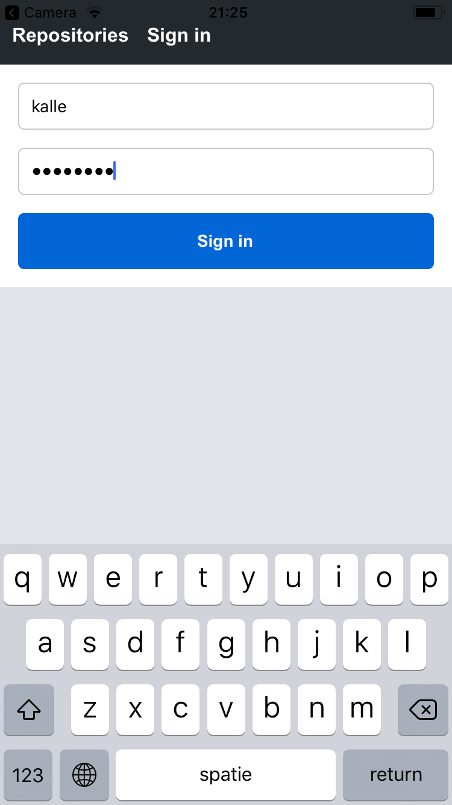
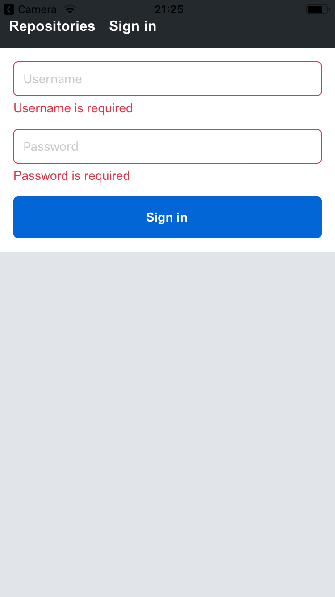
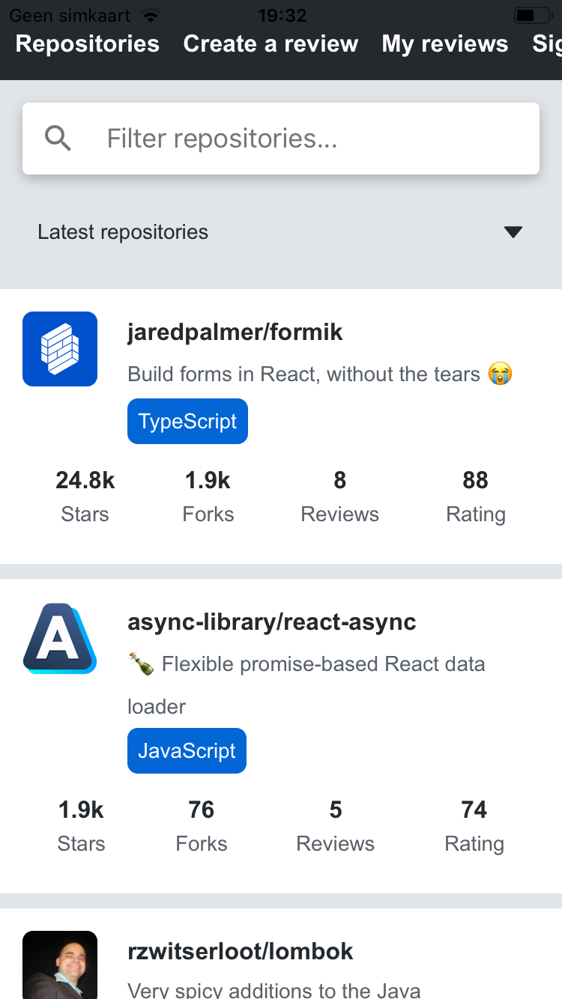
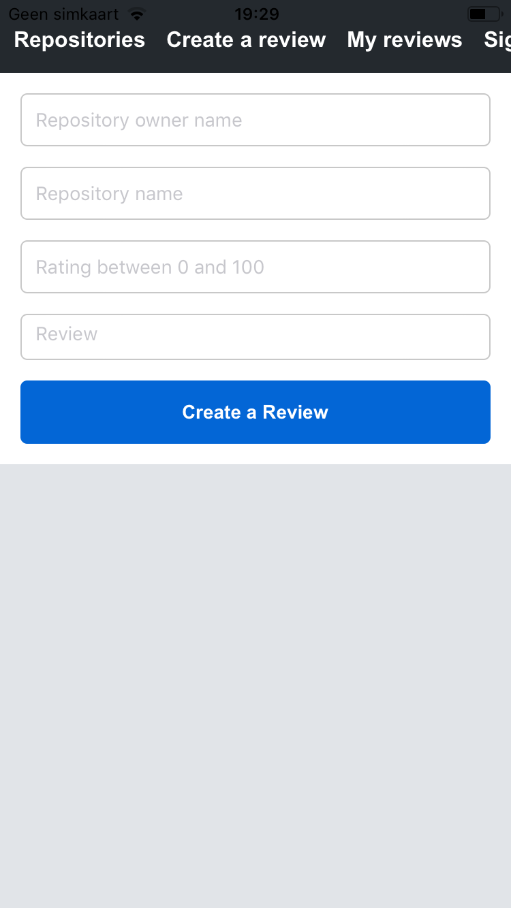
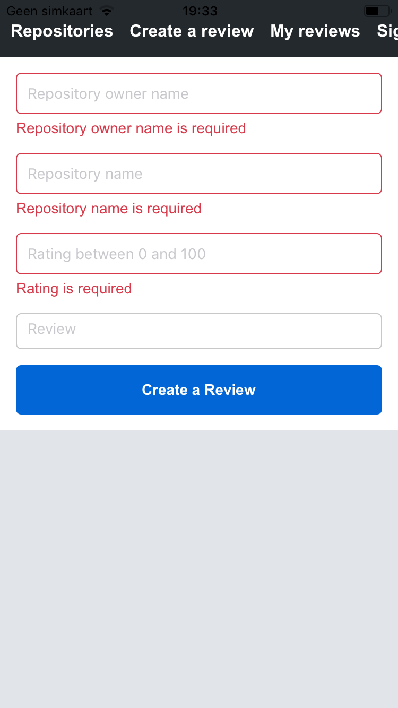
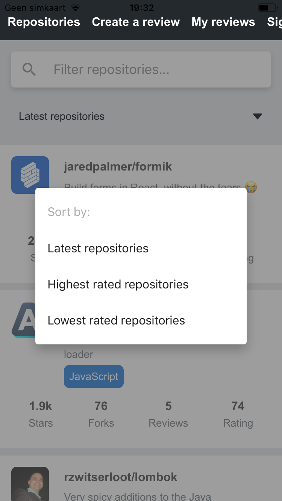
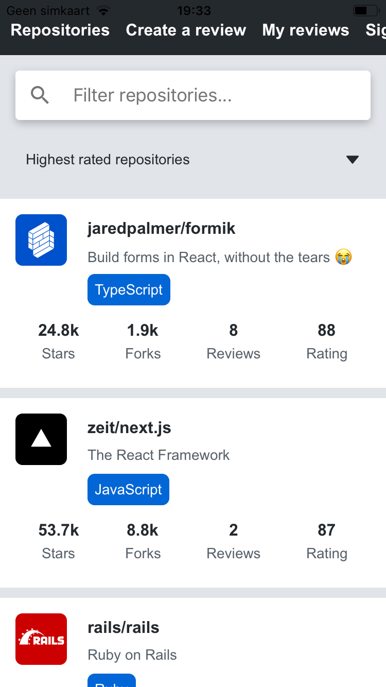
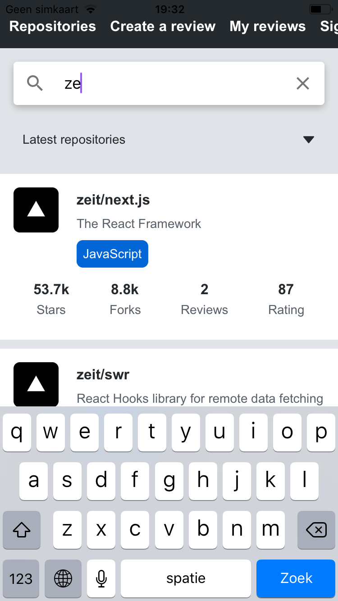
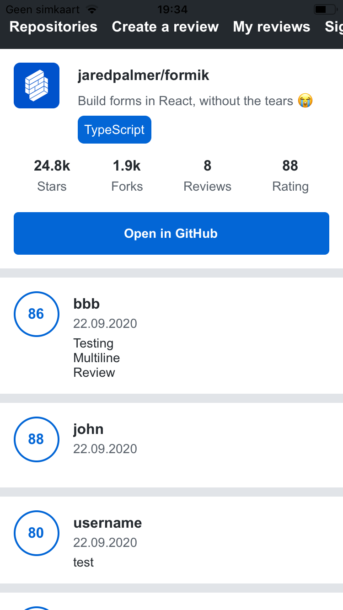
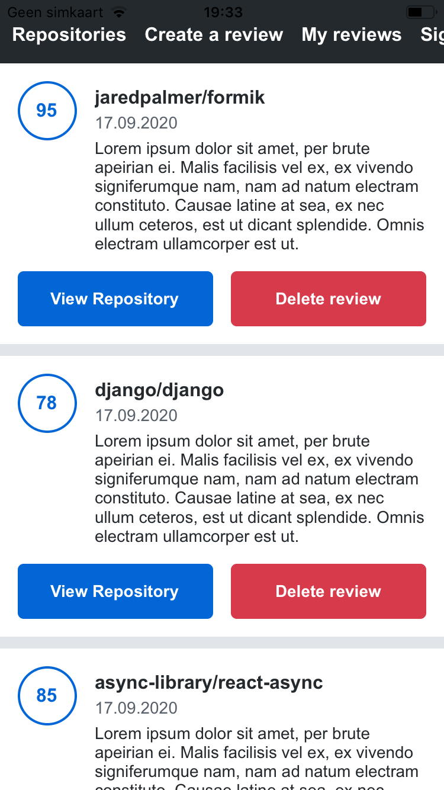
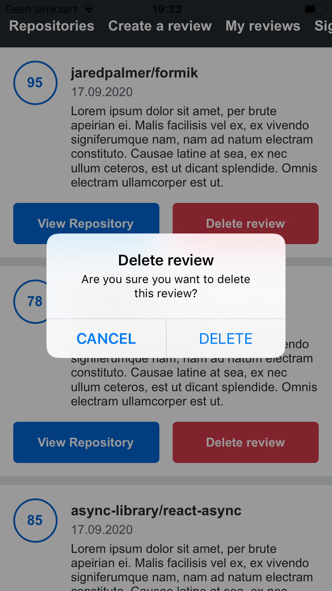

### Course Review part 10 React Native

Course part 10 about React Native was added in September 2020. This course part was added just when I was finishing up part 9 of the course, so great timing :-) <br>

In part 10 of Fullstack Open you will learn to build an Android and iOS mobile app using React Native and Expo. This part is a bit different from the rest of the course. You will build a mobile app following instructions, and in the exercises you will implement additional features in this same app. While in most of the previous parts of the course you did build a different app during the instructions and in the exercises. I personally don't have a reference for either of those, except maybe that you can build more features for one app, which can give you a more pollished product.

**4 parts** <br>
Part is divided into 4 parts:

- Introduction to React Native
- React Native basics
- Communicating with the Server
- Testing and extending your app

### Prerequisits

- basic Javascript knowledge
- basic React knowledge
- basic graphQL knowledge

It is recommended to complete part 1,2,5,7 and 8 of Fullstack Open before starting part 10.

### What you will learn

Part 10 a. Introduction to React Native explains how to setup a React Native app using Expo. <br>
In part 10 b. React Native Basics you will learn about core React Native components, like `<View>` and `<Text>`. In this part you will learn how to use the `FlatList` component, and how to style your React native app using a theme. You will also use `react router native` for routing, and `formik` for handling form state and validation (with `Yup`). <br>
In part 10 c. Communicating with the server you will learn about HTTP requests in React Native, how to use `Apollo Client`, how to store data on a user's device, and how to create a custom hook for data fetching. <br>
Part 10 d. Testing and extending our application is the largest subpart of part 10. You will learn to setup `Jest` and `React Native Testing Library` for React Native and Expo. You will write tests for components, and extend the app by implementing new features, like infinite scrolling.

Above summary of what you will learn isn't an exhaustive list.

### The app you will be building
During the course you will be building an Github repository rating app, in which users can rate Github repositories. The backend is created for you. You will be building a Sign up form, a Sign in form and a Create Review form. You will also display error messages when required input fields are missing, or wrong. You will use Formik for handling form state, together with Yup for validation. You will create a view with a scrollable list of reviewed repositories, a single repository view, and a my repositories view, containing the reviewed repositories of the user. You will be implementing features like infinite scrolling, sorting the reviewed repositories list, and filtering the reviewed repositories list. You can see screenshots of the app I have built during the course [here](#screenshots-of-the-app-created-during-the-course).

### Quality Content

The quality of the course content is great. This is a university course, where people with Finnish social security number can earn 2 credits for (just for part 10).
The course is up-to-date. There is already an issue created for upgrading the course content to use `@apollo/client` instead of `apollo-boost`, upgrade Expo to `Expo SDK 39`, and replace `Touchable` components with `Pressable` component.

### No Videos

This course provides you with written information on how to implement certain features. Then you build these features yourself, and after that you will complete exercises where you are asked to build a similar feature yourself, or extend on something you have build before. This is not a course where someone takes your hand and tells you what to do. But the course does provide enough information for you to be able to complete the exercises and learn a lot. Sometimes links to documentation or other information are given, so you can study that information yourself. The course only has written content, no videos, and it is self-paced.

### Certificate

You can earn a certificate after completing part 10 of Fullstack Open. You can find more information about it [here](https://fullstackopen.com/en/part10/introduction_to_react_native) <br>

### &#10084; &#10084; &#10084; this Course

This course, together with the other parts of the Fullstack Open course is one of my most liked courses. I love that this course is not a simple walkthrough, but gives you some challenges. I am also happy that the course content uses hooks, and is up-to-date. People can do pull requests to improve the course.
I like it that apart from a clear exercise description, the course also provides you with screenshots about what you should build.

### Improvements

It would be nice if the course would use `react navigation` instead of `react-router-native`. The course does mentions the library, but unfortunately it won't be used in the app you will be building. <br>

The other thing I found a bit confusing was the part where you need to extract the side effects from your component so you can test it more easily. The outer component which now is responsible for fetching data gets the name `RepositoryList`, while the inner component which is responsible for rendering the `FlatList` is called `RepositoryListContainer`. I would have found it more logical to switch the names. I see a container like a wrapper, and a container can (sometimes) also be seen as a data fetching/state handling component. This is just a minor point.

### Summary

If you have some experience with Javascript, React and graphQL and want to go through some high quality course material, this is a course for you. If you love getting certificates, you are in the right place. If you expect video content, this course in NOT for you. If you don't want to put in the effort to work through the exercises, this course is NOT for you.
